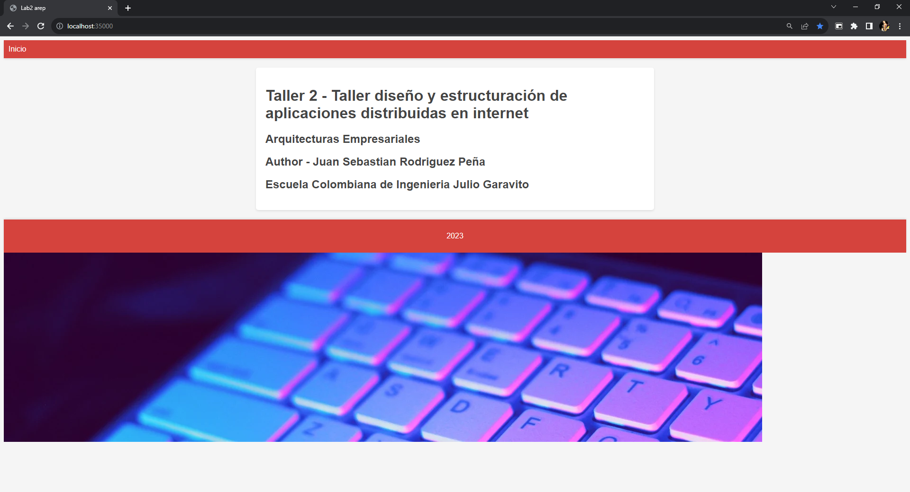
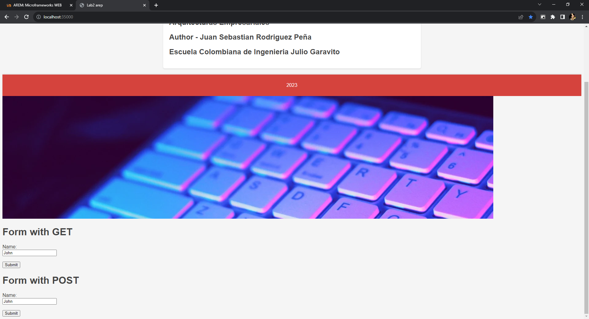
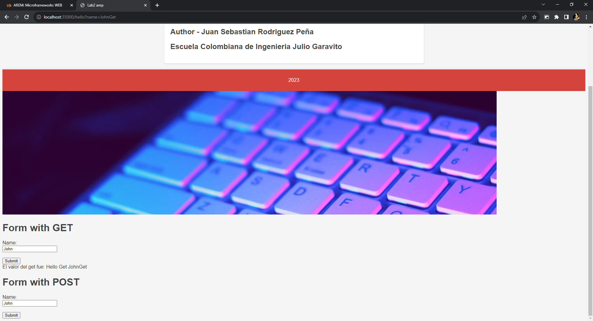

# Microframeworks WEB

En este repositorio se encuentra una aplicacion soporta multiples solicitudes seguidas segun los archivos que pongamos en los recursos ademas de esto soporta la arquitectura del microframework web deniminado Sparkweb. El cual permite construir aplicaciones web de manera simple usando funciones Lambda.

## Para empezar

Descargue o copie el repositorio en su maquina local.

### Prerequisitos

- Java
- Maven

### Ejecucion

Para ejecutar el comando por favor ubiquese en la carpeta de taller3 y ahi ingrese el siguiente comando:

```
mvn clean package exec:java -D "exec.mainClass"="edu.escuelaing.arep.app1.HttpServer"
```

Al estar este en estado de "Listo para recibir ..." Dirigase a la siguiente pagina

```
http://localhost:35000/
```

La pagina deberia verse asi:




La pagina deberia verse asi cuando llamamos el recurso GET del archivo index.html: 



La pagina deberia verse asi cuando llamamos el recurso GET del archivo images.jpeg: 



La pagina deberia verse asi cuando llamamos el recurso POST:


## Built With

- [Maven](https://maven.apache.org/) - Gestión de dependencias
- [JAVA](https://rometools.github.io/rome/) - Lenguaje de programacion utlizado

## Authors

- **Juan Sebastian Rodriguez Peña** - [JSebastianRod](https://github.com/JSebastianRod)
